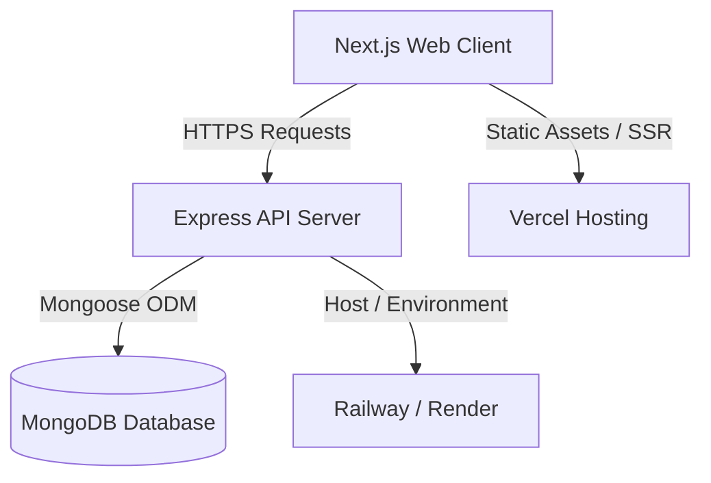

# System Architecture - Sahanaya

This document provides a detailed overview of the system architecture, design decisions, tech stack, styling systems, and security measures for Sahanaya.

---

## 🏛️ System Overview

Sahanaya is designed as a decoupled full-stack application (monorepo structure) optimized for performance, security, and accessibility. 

### ⚡ Technology Stack

#### Frontend
- **Framework**: Next.js 15 (App Router, Server-rendered layout shell, client-interactive sub-elements).
- **Runtime**: React 19, TypeScript.
- **Styling**: Tailwind CSS with custom palette properties.
- **Animations**: Framer Motion for graceful micro-animations.
- **State/Theme Management**: `next-themes` for system-synchronized dark mode.

#### Backend
- **Framework**: Express.js with TypeScript (`ts-node` in dev, compiled to common JS for production).
- **ODM**: Mongoose.
- **Security Middleware**: CORS, Helmet (HTTP Headers security), Express Rate Limit (DDoS mitigation), Express Mongo Sanitize (SQL/NoSQL Injection prevention).
- **Authentication**: JWT token system (Stateless, HttpOnly cookies for storage).

#### Database & Storage
- **Database**: MongoDB (Atlas/Self-hosted).
- **Static Assets**: Cloudinary (planned for article images and user profiles), locally stored SVGs and public items in the Next.js `public/` folder for now.

---

## 🎨 Design System & Styling Tokens

Sahanaya utilizes a calm, soft, and minimal design system designed specifically to evoke tranquility and professional care. We configure the Tailwind theme using CSS variables to support dynamic themes (light/dark modes) seamlessly.

### Color Palette (Wellness Focused)

- **Primary (`#4F8EF7`)**: Soft blue representing trust, calm, and intelligence.
- **Secondary (`#7ED6A5`)**: Soft emerald/mint representing growth, healing, and nature.
- **Accent (`#A78BFA`)**: Soft purple/lavender representing mindfulness, empathy, and wisdom.
- **Background (`#F8FAFC`)**: Soft gray-blue, clean and reduced eye-strain. Dark mode maps to `#0F172A` (Slate 900).
- **Cards / Containers**: Glassmorphism (`backdrop-blur`) for overlay cards, large rounded corners (`rounded-2xl` / `1rem`), and subtle borders (`border-slate-100` / `border-slate-800`).

---

## ♿ Accessibility & Standards

Mental health resources must be highly accessible. Sahanaya implements:
1. **ARIA Roles & Descriptions**: Elements have relevant `aria-label`, `aria-expanded`, and descriptive attributes.
2. **Keyboard Navigation**: Interactive elements (buttons, inputs, links) support standard keyboard focus (`outline-none focus:ring-2 focus:ring-primary`).
3. **Contrast Standards**: Typography contrast ratios adhere to WCAG AA standards in both light and dark modes.
4. **Semantic HTML**: Using structural HTML5 elements (`<header>`, `<main>`, `<footer>`, `<section>`, `<article>`, `<nav>`) rather than generic `
` wrappers.

---

## 🔒 Security Configuration

The Express backend implements production-level security:
1. **Helmet**: Configures safe HTTP headers, blocking clickjacking, MIME sniffing, and setting up referrer policy.
2. **Rate Limiting**: Limits requests per IP (configured differently for login/auth routes vs. resources APIs).
3. **Validation & Sanitization**: Strict input validation using structural types and sanitizers to strip out HTML tags and prevent XSS or database injection.
4. **Authentication Handling**: Guest sessions use a lightweight local JWT. Authenticated users use JWT access/refresh tokens. Cookies are set with `HttpOnly`, `Secure`, and `SameSite=Strict`.
